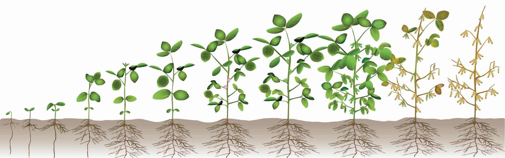

# Introduction

Soybean is the key ingredient behind multiple household food items like tofu, edamame, tempeh, miso, soy sauce, and soy milk. However, most of the soybean that is produced is used to feed animals like cows (~70%). This is just one example of a resource that could be greatly conserved if humans ate at lower trophic levels (i.e., if we consumed soy products and other food items, like corn and grains, directly rather than feeding them to animals). 


# Objectives

1. Identify which countries produced the most soybean in 2013 and what they used it for

+ Ex: How much of the soybean that has been produced in recent years has been used for human compared to animal consumption? 

2. Explore how soybean production and usage in the United States have changed over time

+ Ex: Has the popularity of soybean increased for human consumption in the United States over time?


## Setting Up

```{r setup}
#Load packages

library(tidyverse)
library(dplyr)
library(knitr)
library(ggforce)
```


```{r soybean dataset}
#Import data

soybean_use <- readr::read_csv('https://raw.githubusercontent.com/rfordatascience/tidytuesday/master/data/2021/2021-04-06/soybean_use.csv')

as_tibble(soybean_use)
```


### `soybean_use.csv` Variable Table

|variable    |class     |description |
|:-----------|:---------|:-----------|
|entity      |character | Country|
|code        |character | Country Code |
|year        |double    | Year |
|human_food  |double    | Use for human food (tempeh, tofu, etc) |
|animal_feed |double    | Used for animal food |
|processed   |double    | Processed into vegetable oil, biofuel, processed animal feed |


### Objective 1 - Global Comparisons


```{r total}
#Sums soybean production that is used directly for human food, for animal food, and that is processed into other items

soybean_use <- soybean_use|> 
  group_by(entity, code, year) |> 
  mutate(use_total = c_across(human_food:processed) |> 
         sum(na.rm = TRUE)) |> 
  ungroup()

#Filters by the most recent year (2013) and shows which entities had the greatest combined soybean production

soybean_use_2013 <- soybean_use |> 
  rowwise() |> 
  group_by(entity)  |>
  filter(year == 2013) |> 
  arrange(-use_total) 
 
#Finding percentage of human food, animal food, and processed item usage from the total

soybean_use_2013 |> 
  group_by(entity) |> 
  mutate(
    human_percent = (human_food / use_total) * 100,
    animal_percent = (animal_feed / use_total) * 100,
    processed_percent = (processed / use_total) * 100
    ) 

kable(soybean_use_2013)


#2013's Top 10 countries in soybean production 

top_countries_2013 <- soybean_use_2013 |> 
  filter(entity %in% c("China", "United States", "Brazil", "Argentina", "India", "Germany", "Mexico", "Spain", "Paraguay", "Japan")) 


kable(top_countries_2013)
  

ggplot(data = top_countries_2013) +
  aes(x = reorder(entity, -use_total),
      y = use_total) +
  geom_bar(stat = "identity",
           color = "darkgreen",
           fill = "darkgreen") +
  scale_x_discrete(guide = guide_axis(angle = 45)) +
  labs(title = "Top 10 Soybean-Producing Countries in 2013")


```

Here, we uncovered that China, the United States of America, Brazil, Argentina, India, Germany, Mexico, Spain, Paraguay, and Japan were the top ten soybean producers in the world in 2013.


### Objective 2 - Exploring the USA


```{r soybean plots}
#Developing respective soybean usage percent variables for human, animal, and processed products

usa_soybean_use <- soybean_use |> 
  group_by(entity) |> 
  mutate(
    human_percent = (human_food / use_total) * 100,
    animal_percent = (animal_feed / use_total) * 100,
    processed_percent = (processed / use_total) * 100
    ) |> 
  filter(entity %in% "United States") 

kable(usa_soybean_use)
  
#USA's Soybean Production Use Over Time

usa_production_history <- soybean_use |> 
  filter(entity %in% "United States")

#I truncated the following x-axis to begin at 1980 since soybeans were not used for human food until 1983

ggplot(data = usa_production_history) +
  aes(x = year,
      y = human_food) +
  geom_line(stat = "identity") +
  coord_cartesian(xlim = c(1980,2013)) +
  labs(title = "USA Human Food Soybean Use from 1961-2013")

ggplot(data = usa_production_history) +
  aes(x = year,
      y = animal_feed) +
  geom_line(stat = "identity") +
  facet_zoom(xlim = c(2000, 2013)) +
  labs(title = "USA Animal Food Soybean Use from 1961-2013")

ggplot(data = usa_production_history) +
  aes(x = year,
      y = processed) +
  geom_line(stat = "identity") +
  labs(title = "USA Processed Soybean Use from 1961-2013")

ggplot(data = usa_production_history) +
  aes(x = year,
      y = use_total) +
  geom_line(stat = "identity") +
  facet_zoom(xlim = c(2000, 2013)) +
  labs(title = "USA Total Soybean Production from 1961-2013")

```

# Conclusion

These results show that less soybean was used to make processed foods in recent years compared to in the past in the United States, while the direct use of soybean for animal feed has increased. Directly feeding soybean to animals rather than processing it in factories is promising for the environment as it conserves electrical energy and promotes feeding animals at lower trophic levels, which wastes less resources. 

Unfortunately, the category of soybean being used to make processed goods is conflated with products being made for both humans and animals. For example, there is not a clear distinction between the animal feed category and the use of soybean to make *processed* animal feed. Hopefully, the trend towards direct animal consumption of soybean has continued to increase since 2013. This is still not ideal however, as direct human consumption of soybean would lessen our dependence on livestock farming for diets around the world, particularly in developed countries. 


# Resources


- https://github.com/rfordatascience/tidytuesday/blob/master/data/2021/2021-04-06/readme.md

- https://ourworldindata.org/soy

- https://www.dekalbasgrowdeltapine.com/en-us/agronomy/soybean-growth-stages.html


